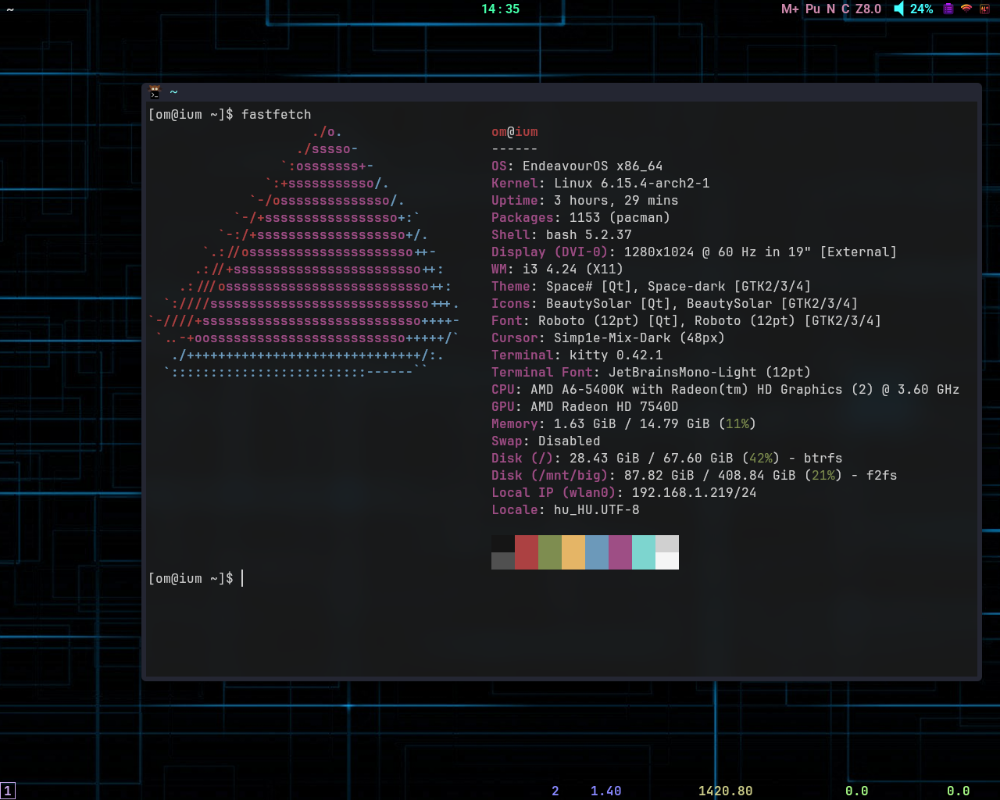
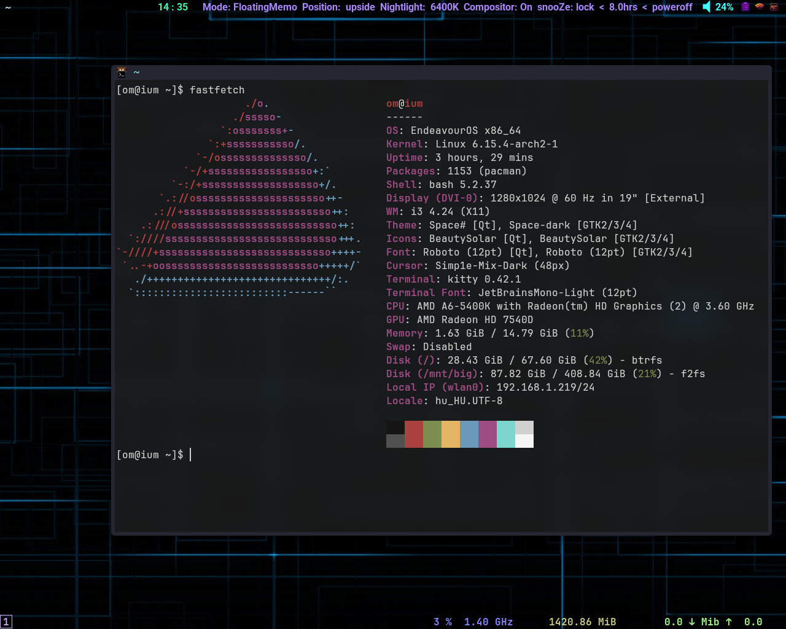

# i3llusion

## about
* a small system via [`newlisp`](http://www.newlisp.org/) script for [`i3wm`](https://i3wm.org/) and [`polybar`](https://polybar.github.io/).
* mostly for tiling/floating windows.
* statuses show on polybar as letters.
* see i3llusion.lsp, i3llusion-i3wm.conf for depidencies.
* need some configuration editing.

## screenshots
* folded statuses(letters) on polybar

* unfolded statuses on polybar

## control by mouse in generally
* button-1: toggle functionality
* button-2: set to default or extra functionallity
* button-3: toggle folding/unfolding
* button-4,5/wheel: adjust value
